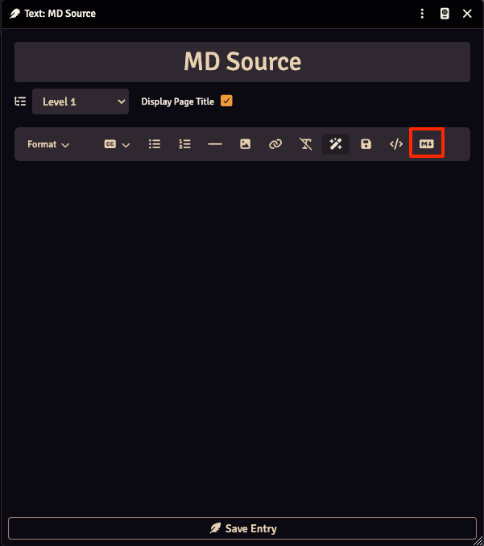
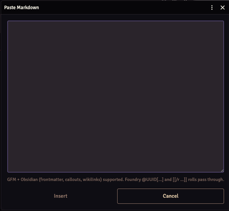
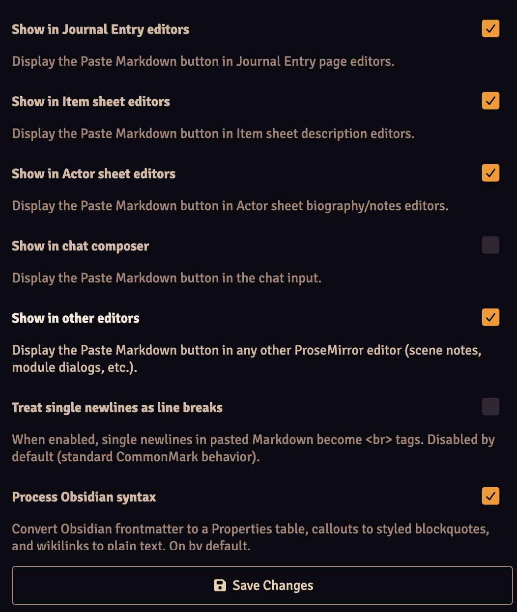

# Markdown Paste

A FoundryVTT module that adds a **"Paste Markdown"** toolbar button to every rich-text editor — Journal pages, item descriptions, actor bios, scene notes. Paste GitHub-Flavored Markdown into the dialog, click Insert, and you get clean HTML at the cursor. Supports Obsidian syntax.

System-agnostic. Works on Foundry v13 and v14.

## Have an idea or a feedback ?
If there's a workflow that annoys you, a small thing that could be smoother, or a feature you keep wishing existed — feel free to reach out on GitHub and describe it. A short note is plenty.

<a href='https://ko-fi.com/E7O820GI4E' target='_blank'></a>

## Features

- Toolbar button in every ProseMirror editor (toggleable per surface), except for the chat box as there's not enough space.
- GFM support: tables, task lists, strikethrough, fenced code, autolinks
- Obsidian support: frontmatter → Properties table, callouts → styled blockquotes, wikilinks → plain text
- Foundry enricher tokens pass through (`@UUID[Actor.x]{Bob}`, `[[/r 1d20]]`, etc.)
- HTML sanitization via DOMPurify — no XSS surface
- Inserts at the cursor (or replaces the selection) — non-destructive

## Installation

In Foundry's **Add-on Modules** tab → **Install Module** → paste this manifest URL:

```
https://github.com/martin-papy/markdown-paste/releases/latest/download/module.json
```

## Usage

1. Open any editor with a ProseMirror toolbar (Journal page, item description, actor bio…).
2. Click the **Markdown** icon in the toolbar.



3. Paste your Markdown into the textarea.



4. Click **Insert**. Converted HTML lands at the cursor.

## Settings

Found under **Configure Settings → Module Settings → Markdown Paste**:

All settings are world-scope.



## Development

```bash
npm install
npm test
```

The unit-testable conversion pipeline (`scripts/convert.js`) is covered by `tests/convert.test.js` via Node's built-in test runner + jsdom.

## Updating vendored dependencies

Runtime libraries (`marked`, `dompurify`) are pinned in `package.json` and the
browser-ready ESM bundles live in `vendor/`. Those bundles are **generated** — do
not edit them by hand.

```bash
npm install            # install pinned dependencies
npm run vendor         # regenerate vendor/ from node_modules
npm test               # verify conversion still behaves
```

CI fails if `vendor/` is out of sync with the pinned versions. A weekly
`update-deps` workflow bumps the libraries to latest, regenerates `vendor/`, runs
the tests, and opens a pull request automatically.

## AI Usage Disclaimer

This module has been developped with the help of an AI Coding assistant (Claude Code). The code has been thoroughly reviewed and tested by a human (me).

## License

MIT — see [LICENSE](LICENSE).
